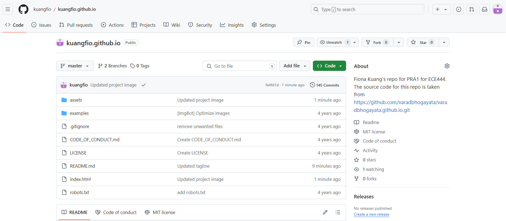

Fiona Kuang's repo for PRA1 for ECE444. The source code for this repo is taken from https://github.com/varadbhogayata/varadbhogayata.github.io.git

# Activity 1

 
  <kbd>
    
    
 Screenshot of the repo after committing the cloned repo and updated readme. 

  </kbd>

# Activity 2

 
  <kbd>
    
    
 Screenshot of the repo after committing the updated information. 

    
    
    
    
 Screenshots of the deployed website. 

  </kbd>

# Activity 3

 
  <kbd>
    
    
 Screenshot of the repo after committing the colour updates. 

    
    
    
 Screenshots of the deployed website after the colour updates. 

  </kbd>

# Activity 4

 
  <kbd>
    
    
 Screenshot of the repo after committing embedded map. 

    
    
 Screenshot of the deployed website with the embedded map. 

  </kbd>

# Activity 5

 
  <kbd>
    
    
 Screenshot of the repo after committing the dynamically loaded projects. 

    
    
    
 Screenshots of the deployed website with the dynamically loaded projects. 

  </kbd>

